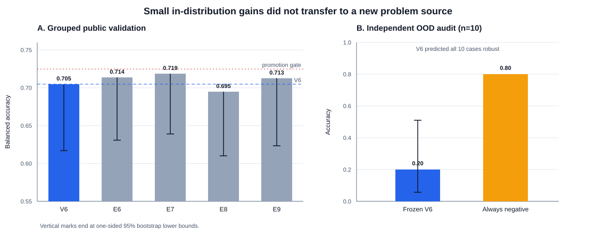

# When Good Probes Fail: Stress-Testing an Efficient Hidden-State Robustness Predictor

**AIMO Interpretability Challenge 2026 — Small Models Track**  
**Author:** XUHANG REN · **Affiliation:** Independent Researcher  
**Contact:** renxuhang2020@qq.com · **Code:** https://github.com/renxuhangrt-dotcom/aimo-interp-probe-stress-tests

## Abstract

We test whether inexpensive hidden-state probes can predict if a mathematical
reasoning model remains correct under meaning-preserving perturbations. Our V6
submission applies balanced linear probes to nine fixed layers of
`DeepSeek-R1-0528-Qwen3-8B` and aggregates 225 hard votes. It achieved 0.705
grouped out-of-fold (OOF) balanced accuracy and 12/19 Small Track private
accuracy with a 4.23 MB bundle. Four registered refinements produced only
small or unstable in-distribution gains; two mechanism-changing follow-ups
then performed near shuffled-label controls. A frozen audit on ten non-overlapping
AIMO problems then found that V6 predicted every problem robust, scoring 0.20
accuracy against an 0.80 always-negative baseline. Thus representation
separability and a small private-set improvement did not establish
out-of-distribution (OOD) reliability. We contribute an auditable zero-direct-
cost workflow, controlled negative results, and practical safeguards for
interpretability research under small, imbalanced datasets.

## Method and validation

The challenge labels a problem–model pair robust when correctness survives
controlled counterfactual perturbations [1]. The official aggregate data had
141 rows but only 137 unique problem IDs; four were exact, label-consistent
duplicates. After collapse, labels were 101 non-robust and 36 robust. The
official 675-row expanded data still contained exactly the same 137 problems,
so perturbation rows were not treated as independent samples.

For each problem, V6 extracts the final prompt-token hidden state from the
frozen 8B model at layers 4, 8, …, 36. Each layer receives a balanced L2
logistic probe (`C=0.001`) after training-partition-only standardization. Five
problem-grouped folds under five fixed seeds yield 25 fold groups × 9 layers =
225 deployment votes. The final threshold is a fixed majority vote. Evaluation
includes both directional source holdouts, shuffled-label controls, 5,000
problem-level bootstrap samples, and exact replay of deployment code.

V6's public evidence was sequentially exploratory, not untouched confirmation.
We therefore pre-registered E6–E9 before evaluation. Promotion required a
+0.02 balanced-accuracy gain over V6, a positive paired-bootstrap lower bound,
strong performance in each source direction, advantage over shuffled labels,
and nontrivial prediction disagreement.

After E10, E11a tested multi-view hidden-state drift and E12 tested a direct
robustness/correctness readout with reversed A/B assignments. Both were
fail-closed before loading the untouched AIME/RRB source.

| Exp. | Change from V6 | OOF BA | OOF acc. | Source BA | Decision |
|---|---|---:|---:|---:|---|
| V6 | Final-token linear votes | 0.7048 | 0.6569 | .675 / .707 | Exploratory pass |
| E6 | Adjacent-layer deltas | 0.7137 | 0.6569 | .675 / .662 | Reject |
| E7 | Mean problem-token state | **0.7186** | 0.6642 | .612 / .756 | Reject |
| E8 | Final problem-token state | 0.6949 | 0.6423 | .658 / .662 | Reject |
| E9 | PCA10 + RBF votes | 0.7126 | **0.7080** | .628 / .768 | Reject |
| E11a | Multi-view latent drift | 0.6273 | 0.6350 | .590 / .717 | Reject |
| E12 | Counterbalanced metacognition | 0.6363 | 0.6350 | .530 / .557 | Reject |

V6 reached 12/19 private accuracy with full coverage and no invalid outputs,
the first non-constant private improvement in our submission sequence. Yet no
successor passed its frozen gate. E6 changed only 2/137 decisions. E7 exposed
the strongest public signal but severe source-direction asymmetry. E8 weakened
both aggregate and transfer evidence. E9 improved ordinary accuracy—the
competition metric—but its paired balanced-accuracy interval crossed zero and
one source direction fell below threshold. E11a was only 0.0337 above its
shuffled control. E12 was only 0.0059 above its control, and reversing A/B made
correctness margins correlate at −0.771, exposing position rather than semantic
judgment. Reporting both accuracy and balanced accuracy was essential under the
101:36 class imbalance.

## Independent audit and negative result

E10 evaluated the already frozen V6 artifact on the direct `qwen3-8b:low`
slice of the separately published ten-problem AIMO sample [2]. Its 64
perturbation rows yielded eight non-robust and two robust problem labels. The
label rule reproduced all 137 official training labels, and overlap was zero by
both problem ID and normalized text. Labels were never supplied to the model or
probe. Before extraction we pinned the dataset, model, and artifact hashes and
required at least eight two-class problems, accuracy ≥0.60, and ≥+0.10 over the
best constant predictor.

V6 predicted all ten cases robust. Accuracy was 0.20, balanced accuracy 0.50,
and the 95% Wilson interval [0.057, 0.510]; always-negative accuracy was 0.80.
The median robust-vote fraction was 0.94 and the minimum 0.769, indicating
confident OOD error rather than a small threshold mismatch. The audit therefore
failed by its registered rule. We did not tune on individual E10 cases and did
not create V8.

## Lessons and limitations

Four lessons follow. First, split at the causal unit: expanded perturbations
of one problem are repeated measurements, not independent data. Second,
randomized-label controls are necessary but insufficient; all candidates beat
their controls while V6 still failed OOD. Third, source symmetry, paired tests,
confidence under shift, and pre-registered stopping rules can prevent marginal
validation gains from becoming leaderboard overfitting. Fourth, counterbalance
elicited judgments: a semantic-looking self-report may actually encode answer
position.

The claim boundary is important. Training used 137 problems from two related
MATH sources; private and OOD samples contained only 19 and ten cases. E10 tests
problem transfer for one 8B checkpoint, not all models or perturbations. Probes
are correlational and do not establish causal mechanisms [3,4]. Our defensible
conclusion is that final-token states contain in-distribution robustness signal,
but neither this probe family nor the tested elicited confidence is supported as
a general detector of robust mathematical reasoning.

All inputs, preregistrations, artifacts, and result JSONs are hash-pinned.
Activation extraction used free Kaggle T4×2 sessions; training, bootstrap,
packaging, and audit ran locally on CPU, incurring zero direct monetary compute
cost. Any future model must start from a distinct mechanistic hypothesis and an
untouched validation source; V6 private outcomes and E10 are permanently frozen
against tuning.

Public code and frozen evidence: https://github.com/renxuhangrt-dotcom/aimo-interp-probe-stress-tests

## References

1. Štefánik et al. *AIMO Interpretability Challenge.* arXiv:2607.13899, 2026. https://arxiv.org/abs/2607.13899
2. AIMO Interpretability Challenge sample-full. https://huggingface.co/datasets/aimo-interp/aimo-interp-challenge-sample-full
3. Belinkov. *Probing Classifiers: Promises, Shortcomings, and Advances.* CL, 2022. https://aclanthology.org/2022.cl-1.7/
4. Hewitt and Liang. *Designing and Interpreting Probes with Control Tasks.* EMNLP-IJCNLP, 2019. https://aclanthology.org/D19-1275/
